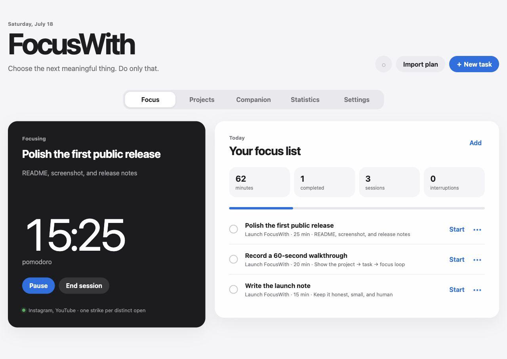

<div align="center">

# FocusWith

**A private-by-default focus system that helps turn meaningful plans into finished work.**

[简体中文](README.zh-CN.md) · [Install](#fastest-installation) · [Local MCP](docs/MCP.md) · [Claude.ai Remote MCP](docs/REMOTE_MCP.md)

</div>



FocusWith turns vague goals into directions, projects, tasks, and focused sessions. It keeps the core loop simple: choose one thing, start, return when distracted, finish, and decide what comes next.

It works without Telegram and without an AI key. The core is a self-hosted web app; optional adapters add an AI companion, MCP connections, Telegram buttons, iPhone Shortcut events, and a native macOS floating timer.

> **Public preview:** FocusWith is currently a single-owner `0.x` project. Back up your data before upgrading and review AI tool actions before approving them.

## Why FocusWith

- **Private by default.** Local installs bind to `127.0.0.1`; public MCP is opt-in and OAuth-protected.
- **Plans become something you can do.** Organize directions → projects → tasks, or paste a Markdown plan generated by an AI chat.
- **The loop does not stop at a timer.** FocusWith records sessions, merges repeated work on the same task, carries unfinished work forward, and recommends the next action.
- **AI is optional, not the owner.** Use the app alone, add a provider, or connect an existing Claude/Codex-compatible client through MCP.
- **Distraction reminders have context.** Phone events can be linked to the active session, with grace periods, strikes, reminders, and user-defined consequences.

## What works

- Directions, projects, actionable tasks, and manual project assignment.
- Markdown plan import with duration parsing and break recognition.
- Pomodoro, deep-focus, free-focus, and count-up sessions with custom durations.
- Pause, resume, finish, cancel, complete, and abandon flows.
- Daily and weekly statistics; repeated sessions for one task are merged into one activity total.
- Editable monitored-app policy, grace period, strike count, and consequence pool.
- Browser notifications and optional Telegram delivery with action buttons.
- iPhone Shortcut event ingestion and daily app-usage summaries.
- Built-in companion using Anthropic or any OpenAI-compatible API, including compatible local endpoints.
- Seven annotated MCP tools for Claude Desktop/Code, Codex, and other local clients.
- Optional OAuth-protected Remote MCP for Claude.ai, with automated clean-VPS HTTPS deployment.
- Native macOS floating timer built with Command Line Tools; full Xcode is not required.
- Local installer and Docker Compose deployment.

## Fastest installation

Give this repository to a coding agent and ask it to install FocusWith. The exact prompt and safety contract are in [docs/AI_INSTALL.md](docs/AI_INSTALL.md) and [AGENTS.md](AGENTS.md).

Manual installation requires Python 3.11 or newer:

```bash
./scripts/install.sh
./scripts/focus start
```

Open `http://127.0.0.1:8765`. On localhost, the browser connects without asking you to copy the generated API token.

Useful commands:

```bash
./scripts/focus status
./scripts/focus doctor
./scripts/focus logs
./scripts/focus stop
```

## Optional AI and MCP

For the built-in companion, edit the ignored `.env` file and restart FocusWith:

```dotenv
FOCUS_AI_PROVIDER=anthropic
FOCUS_AI_API_KEY=your-provider-key
FOCUS_AI_MODEL=your-model-name
```

For DeepSeek, GLM, a local model, or another compatible service:

```dotenv
FOCUS_AI_PROVIDER=openai-compatible
FOCUS_AI_API_KEY=your-provider-key
FOCUS_AI_MODEL=your-model-name
FOCUS_AI_BASE_URL=https://provider.example/v1
```

Provider keys stay on the server and are never sent to browser JavaScript.

To use an existing AI client, connect the private local server in [docs/MCP.md](docs/MCP.md). For Claude.ai, follow [docs/REMOTE_MCP.md](docs/REMOTE_MCP.md). Remote mode uses HTTPS, OAuth discovery, Dynamic Client Registration, S256 PKCE, rotating refresh tokens, strict callback allowlisting, and revocation; it is disabled by default.

## Optional integrations

- macOS floating timer: `./macos/FocusFloat/install.sh`
- iPhone Shortcuts: [docs/IPHONE_SHORTCUTS.md](docs/IPHONE_SHORTCUTS.md)
- Telegram: set `FOCUS_TELEGRAM_BOT_TOKEN` and `FOCUS_TELEGRAM_CHAT_ID` in `.env`, then restart.

Telegram is a delivery adapter, not the owner of the Focus session. Timer completion and distraction events are created by FocusWith, then delivered to the browser and any enabled channel.

## Docker and Remote MCP

Local Docker deployment:

```bash
./scripts/setup_env.py
docker compose up -d --build
```

Compose publishes only to `127.0.0.1:8765` by default and stores the database in a named volume.

For a dedicated public hostname and Claude.ai connector on a clean Docker VPS:

```bash
./scripts/deploy_remote.sh --domain focus.example.com
```

The script refuses to replace an existing service on ports 80/443. See [docs/REMOTE_MCP.md](docs/REMOTE_MCP.md) for prerequisites, the existing-proxy mode, Claude connection steps, password rotation, and revocation commands.

## Security

- The default server bind is `127.0.0.1`.
- Separate random tokens protect the main API and phone-event endpoint.
- Runtime data, `.env`, logs, generated apps, and databases are ignored by Git.
- API/provider tokens are not embedded in JavaScript, documentation, MCP configuration, or the macOS bundle.
- Remote MCP cannot run with only half of its OAuth configuration.
- Claude.ai Remote MCP uses a salted owner-password hash, strict callback allowlisting, PKCE, scoped audience-bound bearer tokens, rotation, and revocation.
- OAuth bearer tokens, refresh tokens, authorization codes, login tickets, and CSRF artifacts are stored only as hashes.

Read [SECURITY.md](SECURITY.md) before exposing FocusWith outside localhost.

## Development

```bash
python3.12 -m venv .venv
.venv/bin/pip install -r requirements-dev.txt
.venv/bin/pytest -q
./macos/FocusFloat/build.sh
```

The server API is documented at `/docs` while it is running. Contributions are welcome under the [MIT License](LICENSE); see [CONTRIBUTING.md](CONTRIBUTING.md).

## Credits

Created by [@sayhi2e10414-cpu](https://github.com/sayhi2e10414-cpu), built together with OpenAI Codex.
