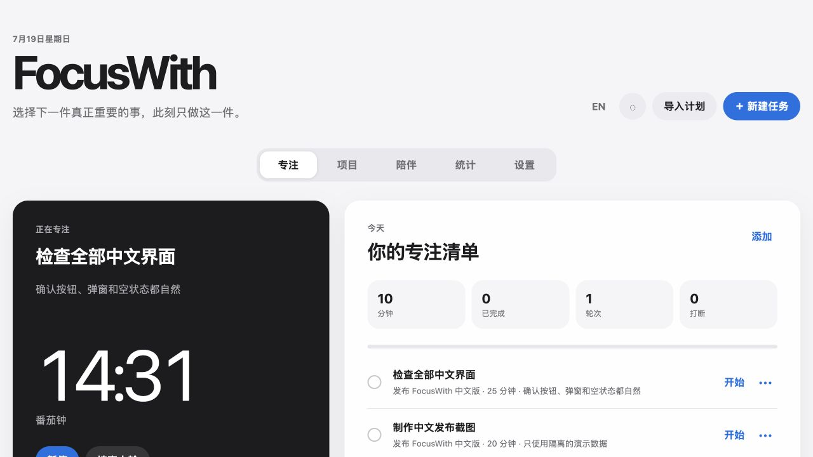

<div align="center">

# FocusWith

**一个默认私密、会陪你把计划真正做完的专注系统。**

[English](README.md) · [快速安装](#快速安装) · [本地-mcp](docs/MCP.md) · [claudeai-remote-mcp](docs/REMOTE_MCP.md)

</div>



FocusWith 把模糊目标整理成方向、项目、任务和一次次专注。它关心的不只是倒计时，而是完整的一轮：选一件事、开始、分心后回来、完成，然后自然地进入下一步。

它不依赖 Telegram，也不强制使用 AI。核心是一套可自托管的网页应用；你可以按需加入 AI 伙伴、MCP、Telegram 按钮、iPhone 快捷指令事件和 macOS 原生悬浮计时器。

网页会在中文浏览器中自动显示简体中文，也可以随时切换为 English；选择只保存在当前浏览器中。

> **公开预览版：** FocusWith 目前是面向单个所有者的 `0.x` 项目。升级前请备份数据，并在允许 AI 调用工具前检查它准备执行的操作。

## 为什么做 FocusWith

- **默认私密。** 本地安装只监听 `127.0.0.1`；公网 MCP 必须主动开启，并由 OAuth 保护。
- **让计划变得可执行。** 使用“方向 → 项目 → 任务”组织事情，也可以直接粘贴 AI 聊天生成的 Markdown 计划。
- **不在计时结束时撒手。** 它会记录每轮专注、合并同一任务的数据、承接昨天未完成的任务，并推荐下一项行动。
- **AI 是可选伙伴，不是系统主人。** 可以完全不用 AI，也可以接入模型供应商，或让 Claude、Codex 等客户端通过 MCP 操作有限的 Focus 工具。
- **分心提醒知道你正在做什么。** 手机事件可以和当前专注轮关联，并配置宽限时间、提醒次数、冷却时间及自定义后果。

## 现有功能

- 方向、项目、可执行任务，以及手动归属项目。
- 简体中文／English 双语界面，自动识别浏览器语言并记住手动选择。
- 导入 Markdown 计划，识别任务时长和休息段落。
- 番茄钟、深度专注、自由专注、正计时与自定义时长。
- 暂停、继续、结束、取消、完成和放弃流程。
- 每日／每周统计；同一个任务的多轮专注会合并计算。
- 可编辑的监控 App、宽限时间、累计次数和后果池。
- 浏览器通知，以及可选的 Telegram 按钮消息。
- iPhone 快捷指令事件与每日 App 使用时长汇总。
- 可选的 Anthropic 或 OpenAI-compatible 内置 AI 伙伴，兼容 DeepSeek、GLM 和本地接口。
- 7 个带安全提示的 MCP 工具，可供 Claude Desktop/Code、Codex 等本地客户端使用。
- 面向 Claude.ai 的 OAuth Remote MCP，以及干净 VPS 的 HTTPS 自动部署。
- 只需 Command Line Tools 的 macOS 原生悬浮计时器，不要求完整 Xcode。
- 本地安装脚本和 Docker Compose。

## 快速安装

最省事的方式，是把仓库交给一个编码 Agent，并让它先阅读 [AGENTS.md](AGENTS.md) 后安装。完整提示词在 [docs/AI_INSTALL.md](docs/AI_INSTALL.md)。

手动安装需要 Python 3.11 或以上版本：

```bash
./scripts/install.sh
./scripts/focus start
```

打开 `http://127.0.0.1:8765`。本机浏览器会自动完成本地连接，不需要复制生成的 API Token。

常用命令：

```bash
./scripts/focus status
./scripts/focus doctor
./scripts/focus logs
./scripts/focus stop
```

## 可选 AI 与 MCP

如果要启用内置 AI 伙伴，在被 Git 忽略的 `.env` 中配置模型，然后重启：

```dotenv
FOCUS_AI_PROVIDER=anthropic
FOCUS_AI_API_KEY=your-provider-key
FOCUS_AI_MODEL=your-model-name
```

DeepSeek、GLM、本地模型或其他 OpenAI-compatible 服务：

```dotenv
FOCUS_AI_PROVIDER=openai-compatible
FOCUS_AI_API_KEY=your-provider-key
FOCUS_AI_MODEL=your-model-name
FOCUS_AI_BASE_URL=https://provider.example/v1
```

供应商 Key 只保存在服务器端，不会进入浏览器 JavaScript。

要连接现有 AI 客户端，请阅读 [本地 MCP 指南](docs/MCP.md)。Claude.ai 需要公网 HTTPS 地址，请阅读 [安全 Remote MCP 部署指南](docs/REMOTE_MCP.md)。Remote MCP 默认关闭，并使用 OAuth 发现、动态客户端注册、S256 PKCE、严格回调白名单、刷新令牌轮换和撤销机制。

## 可选集成

- macOS 悬浮计时器：`./macos/FocusFloat/install.sh`
- iPhone 快捷指令：[docs/IPHONE_SHORTCUTS.md](docs/IPHONE_SHORTCUTS.md)
- Telegram：在 `.env` 设置 `FOCUS_TELEGRAM_BOT_TOKEN` 和 `FOCUS_TELEGRAM_CHAT_ID` 后重启。

Telegram 只负责投递消息，不持有专注状态。计时结束与分心事件由 FocusWith 生成，再交给浏览器或启用的消息通道。

## Docker 与 Claude.ai

本地 Docker 部署：

```bash
./scripts/setup_env.py
docker compose up -d --build
```

默认只映射到 `127.0.0.1:8765`，数据库保存在独立 Docker Volume 中。

在拥有专用域名的干净 Docker VPS 上部署 Claude.ai Connector：

```bash
./scripts/deploy_remote.sh --domain focus.example.com
```

如果 80/443 端口已经被 Nginx、Caddy 或其他网站占用，脚本会主动停止，不覆盖现有服务。已有反向代理的安装方式、Claude 连接步骤、密码轮换和一键撤销命令都在 [docs/REMOTE_MCP.md](docs/REMOTE_MCP.md)。

## 安全设计

- 默认只监听 `127.0.0.1`。
- 主 API 与手机事件使用不同的随机 Token。
- `.env`、数据库、日志、生成 App 和运行数据都被 Git 忽略。
- API／模型 Key 不会嵌入网页 JavaScript、文档、MCP 配置或 macOS App 包。
- OAuth 配置不完整时，Remote MCP 无法启动。
- Claude.ai Remote MCP 使用加盐密码哈希、严格回调白名单、PKCE、Scope 与 Audience 校验、轮换和撤销。
- Access Token、Refresh Token、授权码、登录 Ticket 与 CSRF 值只以哈希形式保存。

从本机开放到公网前，请先阅读 [SECURITY.md](SECURITY.md)。

## 开发

```bash
python3.12 -m venv .venv
.venv/bin/pip install -r requirements-dev.txt
.venv/bin/pytest -q
./macos/FocusFloat/build.sh
```

服务运行时可在 `/docs` 查看 API。项目使用 [MIT License](LICENSE)，贡献方式见 [CONTRIBUTING.md](CONTRIBUTING.md)。

## 致谢

由 [@sayhi2e10414-cpu](https://github.com/sayhi2e10414-cpu) 发起，与 OpenAI Codex 一起完成。
